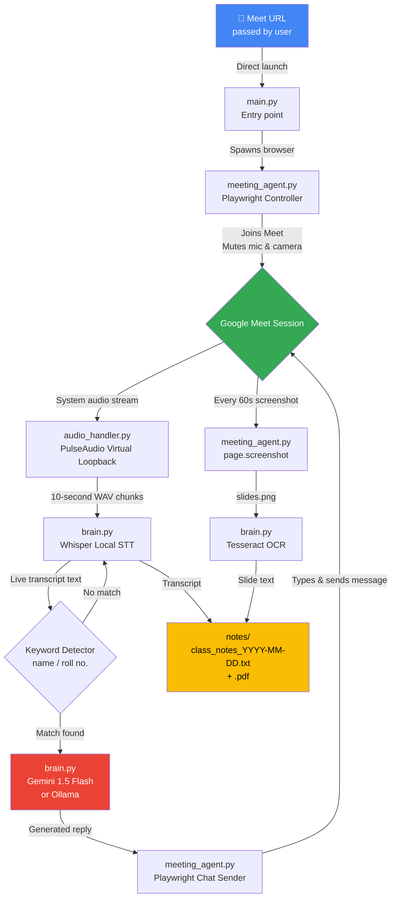

# 🤖 Google Meet AI Attendance Agent

<div align="center">


**A fully autonomous AI agent that joins your Google Meet classes, marks attendance, answers questions, captures slides, and saves detailed notes — completely free.**

[Features](#-features) · [Architecture](#-architecture) · [Tech Stack](#-tech-stack) · [Project Structure](#-project-structure) · [Setup](#-setup--installation) · [Usage](#-how-to-run) · [Screenshots](#-results--screenshots) · [Troubleshooting](#-troubleshooting)

</div>

---

## 📖 Overview

**Google Meet AI Attendance Agent** is a Python-based autonomous bot that joins your Google Meet sessions on your behalf. It uses a pipeline of free and open-source tools to:

- 🎙️ **Listen** to the teacher via real-time audio capture and local transcription
- 🧠 **Understand** context — whether it's an attendance roll call or a question directed at you
- 💬 **Respond** automatically in the Meet chat with contextually appropriate answers
- 📸 **See** the screen and capture slide content via OCR every 60 seconds
- 📝 **Save** timestamped class notes combining the audio transcript and slide text

The entire pipeline runs on **free-tier APIs** and **locally-run open-source models**, with zero recurring cost.

---

## ✨ Features

| Feature | Description |
|---|---|
| 🤖 **Direct Join** | Pass a Meet URL directly and the agent joins immediately |
| 🎤 **Live Transcription** | Captures system audio and transcribes with local Whisper — no paid STT API needed |
| 🙋 **Attendance Detection** | Detects your name or roll number in the transcript and responds "Present" in chat |
| 🤔 **Question Answering** | Sends the transcript context to Gemini Flash and replies with a 1-sentence answer |
| 📸 **Slide OCR** | Screenshots the screen every 60 seconds and extracts text with Tesseract |
| 📓 **Auto Notes** | Saves a structured `.txt` and `.pdf` file per class with timestamps, transcript, and slide text |
| 🔇 **Ghost Mode** | Joins with mic and camera off — completely silent to other participants |
| 🦙 **Ollama Support** | Optional local LLM alternative to Gemini — no API key required at all |
| ⚙️ **Configurable** | Single `config.py` file controls everything: name, model size, headless mode, and more |

---

## 🏗️ Architecture

The diagram below shows the complete data flow from meeting URL input to notes generation:



**How the pipeline works, step by step:**

1. **Entry** — You run `main.py` with a Meet URL (or `meeting_agent.py` directly). The orchestrator spawns a Playwright-controlled Chrome browser that joins the call with mic and camera disabled.
2. **Audio Thread** — `audio_handler.py` creates a PulseAudio virtual loopback device so Python can "hear" the browser's audio output. It records in 10-second chunks and hands them to `brain.py`, which runs Whisper locally to produce a transcript.
3. **Keyword Detection** — `brain.py` scans every transcript chunk for your name or roll number. When a match is found, it sends the last 30 seconds of transcript to Gemini Flash (or Ollama) to determine if it's an attendance call or a question, then generates the appropriate reply.
4. **Chat Response** — `meeting_agent.py` uses Playwright to open the chat panel, type the generated response, and press Enter — all within a couple of seconds of detection.
5. **OCR Thread** — In parallel, `meeting_agent.py` takes a full-page screenshot every 60 seconds. `brain.py` runs Tesseract OCR on the image to extract any slide or shared-screen text.
6. **Notes** — Both the Whisper transcript and the OCR slide text are written (with timestamps) to `notes/class_notes_YYYY-MM-DD.txt`, which is also exported as a `.pdf` at the end of the session.

---

## 🛠️ Tech Stack

| Component | Tool | Cost |
|---|---|---|
| **Browser Automation** | [Playwright](https://playwright.dev/) | Free / Open-source |
| **Audio Capture** | [PulseAudio](https://www.freedesktop.org/wiki/Software/PulseAudio/) virtual loopback | Free (Linux system tool) |
| **Speech-to-Text** | [OpenAI Whisper](https://github.com/openai/whisper) — runs locally | Free / No API calls |
| **AI Brain** | [Gemini 1.5 Flash API](https://aistudio.google.com/) | Free tier: 15 RPM, 1M context |
| **AI Brain (Alt)** | [Ollama](https://ollama.com/) — local LLM | Free / Fully offline |
| **OCR** | [Tesseract OCR](https://github.com/tesseract-ocr/tesseract) | Free / Open-source |

---

## 📂 Project Structure

```
Google-Meet-AI-Attendence-Agent/
│
├── main.py                  # 🎛️  Entry point and orchestrator
├── meeting_agent.py         # 🌐  Playwright browser control — joins Meet, sends chat, takes screenshots
├── audio_handler.py         # 🎤  PulseAudio virtual loopback — captures system audio in chunks
├── brain.py                 # 🧠  Whisper STT, Tesseract OCR, and Gemini/Ollama API calls
├── config.py                # ⚙️  All configuration — edit this file before running
├── download_model.py        # ⬇️  Pre-downloads the Whisper model (run once before first use)
├── ollama                   # 🦙  Ollama integration config / helper
├── requirements.txt         # 📋  Python dependencies
│
├── whisper-model-turbo/     # 📦  Whisper model weights (populated by download_model.py)
│   └── model.bin
│
├── notes/                   # 📓  Auto-generated class notes (created at runtime)
│   ├── class_notes_2026-03-13.txt.processed
│   └── class_notes_2026-03-13_1773345475.pdf
│
├── docs/
│   └── assets/
│       ├── architecture/    # 🗺️  Diagrams (PNG + SVG)
│       └── testing/         # 📸  Result screenshots
│
├── .gitignore               # 🔒  Excludes credentials, tokens, and browser profile
└── LICENSE                  # MIT
```

> **Important:** `playwright_profile/` (the saved browser login session), `credentials.json`, and `token.json` are all excluded by `.gitignore` and must be set up locally on your machine. The agent is launched manually with a direct Meet URL.

---

## 🔑 What You Need Before Starting

You need **three things** to run this agent. The first two are critical files that must be in the project root — without them the agent cannot authenticate with Google and will not run.

---

### 🔴 CRITICAL — `credentials.json`

This is your **Google OAuth2 client secret file**. It tells Google which application is requesting access so the agent can authenticate under your Google account and join Meet sessions.

**How to get it (one-time setup):**

1. Go to [console.cloud.google.com](https://console.cloud.google.com/) and sign in
2. Click **New Project** → name it (e.g. `meet-agent`) → **Create**
3. Go to **APIs & Services** → **OAuth consent screen** → select **External** → **Create**
   - Fill in App name, support email, and developer contact (all can be your own Gmail)
   - Click through all steps; on the **Test users** page, add your own Gmail address
   - Click **Back to Dashboard**
4. Go to **APIs & Services** → **Credentials** → **+ Create Credentials** → **OAuth client ID**
   - Application type: **Desktop app**
   - Name it anything (e.g. `meet-agent-desktop`) → **Create**
5. Click **⬇️ Download JSON** next to the credential you just created
6. Rename the downloaded file to `credentials.json` and move it into the project root:

```bash
cp ~/Downloads/credentials.json ~/Google-Meet-AI-Attendence-Agent/credentials.json
```

> ⚠️ **Never commit this file to Git.** It is already covered by `.gitignore`. Keep a personal backup in a safe location (e.g. your Google Drive or Downloads folder) — if your volume is wiped, you can restore it with `cp ~/Downloads/credentials.json .`

---

### 🔴 CRITICAL — `token.json`

This is your **OAuth2 access token**. It is generated automatically the first time you run the agent and complete the Google sign-in flow in the browser (Step 8 of setup). You do **not** create this manually.

Once it exists, **immediately back it up**:

```bash
cp ~/Google-Meet-AI-Attendence-Agent/token.json ~/Downloads/token.json
```

If your volume is wiped and you have a backup, restore it to skip re-authentication entirely:

```bash
cp ~/Downloads/token.json ~/Google-Meet-AI-Attendence-Agent/token.json
```

> ⚠️ **Never commit this file to Git.** It is already covered by `.gitignore`. If it is lost without a backup, simply re-run the agent with `HEADLESS_BROWSER = False` and sign in again — a new `token.json` will be generated.

---

### 3. Gemini API Key (Free)

Get a free key from [Google AI Studio](https://aistudio.google.com/):

1. Go to [aistudio.google.com](https://aistudio.google.com/) and sign in
2. Click **Get API Key** → **Create API key in new project**
3. Copy the key — you will paste it into `config.py` in Step 7

The free tier gives you **15 requests per minute** and a **1 million token context window**, which is more than enough for a full class session.

> **Optional:** If you prefer a fully offline setup, use Ollama instead of Gemini — no API key needed at all. See the [Ollama section](#-using-ollama-instead-of-gemini) below.

---

## 🚀 Setup & Installation

### Step 1: Install System Dependencies

```bash
sudo apt update && sudo apt install -y \
    tesseract-ocr \
    portaudio19-dev \
    pulseaudio \
    ffmpeg \
    git
```

### Step 2: Clone the Repository

```bash
git clone https://github.com/code-with-idrees/Google-Meet-AI-Attendence-Agent.git
cd Google-Meet-AI-Attendence-Agent
```

### Step 3: Create a Virtual Environment (Recommended)

```bash
python3 -m venv venv
source venv/bin/activate
```

### Step 4: Install Python Dependencies

```bash
pip install -r requirements.txt
```

### Step 5: Install Playwright's Chromium Browser

```bash
playwright install chromium
playwright install-deps chromium
```

### Step 6: Pre-Download the Whisper Model

This downloads the model weights into `whisper-model-turbo/` so there's no delay on the first real run:

```bash
python3 download_model.py
```

> The `turbo` model (~800 MB) gives the best speed/accuracy balance. If you're on a low-RAM machine, change `WHISPER_MODEL = "tiny"` in `config.py` before running this — the tiny model is only ~75 MB.

### Step 7: Configure `config.py`

Open `config.py` and fill in your details. These are the critical fields:

```python
# ── Your Identity ────────────────────────────────────────────────────────────
STUDENT_NAME    = "Idrees"       # Your name — the agent listens for this in the transcript
ROLL_NUMBER     = "21-CS-42"     # Your roll number — also triggers the keyword detector

# ── Gemini API ───────────────────────────────────────────────────────────────
GEMINI_API_KEY  = "AIzaSy..."    # Paste your free key from aistudio.google.com

# ── Whisper Model ─────────────────────────────────────────────────────────────
# "tiny" = fastest ~75MB | "base" = ~150MB | "small" = ~480MB | "turbo" = best ~800MB
WHISPER_MODEL   = "turbo"

# ── Browser ──────────────────────────────────────────────────────────────────
HEADLESS_BROWSER = True          # Set to False for first login and debugging

# ── Timing ───────────────────────────────────────────────────────────────────
AUDIO_CHUNK_SECONDS   = 10       # How often Whisper processes audio
SCREENSHOT_INTERVAL_S = 60       # How often slides are captured
ATTENDANCE_CONTEXT_S  = 30       # Seconds of transcript sent to Gemini when name detected
```

Alternatively, export the key as an environment variable instead of hardcoding it:

```bash
export GEMINI_API_KEY="AIzaSy..."
```

### Step 8: First-Time Google Login

The agent uses a persistent Playwright browser profile (`playwright_profile/`) to stay logged into Google. You need to create this once:

```bash
# 1. Open config.py and set:
#    HEADLESS_BROWSER = False

# 2. Run the agent with any Meet URL
python3 meeting_agent.py "https://meet.google.com/abc-defg-hij"

# 3. When the Chrome window opens, sign into your Google Account manually.
#    The session is automatically saved to playwright_profile/

# 4. Close the browser and set HEADLESS_BROWSER = True in config.py
```

From this point on, the agent will reuse the saved session silently on every run.

---

## 🦙 Using Ollama Instead of Gemini

For a fully offline, API-key-free setup:

```bash
# 1. Install Ollama
curl -fsSL https://ollama.com/install.sh | sh

# 2. Pull a lightweight model
ollama pull gemma:2b

# 3. In config.py, switch the brain:
USE_OLLAMA   = True
OLLAMA_MODEL = "gemma:2b"
```

The `ollama` file in the project root contains the helper configuration for this integration.

---

## 🏃 How to Run

### Direct Mode — Join Immediately

Pass a Meet URL and the agent joins right away:

```bash
python3 meeting_agent.py "https://meet.google.com/abc-defg-hij"
```

### Via Main Orchestrator

```bash
python3 main.py
```

---

### What Happens After Joining

```
✅ Mic muted automatically
✅ Camera off automatically
✅ "Join now" / "Ask to join" clicked
✅ Chat pane opened and ready

── Audio Thread ─────────────────────────────────────────────────────────────
  🎙️  PulseAudio loopback records browser audio in 10-second chunks
  📝  Whisper transcribes each chunk locally (no API call)
  🔍  Keyword detector scans for your name or roll number
  🤖  If found → Gemini Flash (or Ollama) generates the reply
  💬  Playwright types the reply into chat and hits Enter

── Visual Thread ────────────────────────────────────────────────────────────
  📸  Screenshot taken every 60 seconds
  🔤  Tesseract extracts text from the slide / shared screen
  📓  Text appended to notes/class_notes_YYYY-MM-DD.txt with PDF export
```

---

## 📸 Results & Screenshots

### ✅ Automatic Meeting Join

The agent opens a Playwright-controlled browser, navigates to the Meet URL, and clicks through the join flow autonomously, with mic and camera muted.


---

### 🙋 Attendance — "Present" Reply

When the teacher calls the student's name during roll call, the agent detects the keyword in the Whisper transcript and immediately sends the attendance message in chat.


---

### ❓ Question Detected and Answered

When the agent detects a question directed at the student, it sends the transcript to Gemini Flash and posts the AI-generated 1-sentence answer in the Meet chat.


---

### 💬 Live Chat Reply

A close-up of the Meet chat pane showing the bot's response after a question is asked.


---

### 🔍 Audio, Screen & Chat Monitoring

All monitoring threads running simultaneously — audio transcription in the background, screen OCR, and chat surveillance.


---

### 📓 Notes Being Captured

The agent writing slide text (Tesseract OCR) and audio transcript (Whisper) to the notes file in real time during a live session.


---

### 📄 Final Notes Output

The generated notes file at the end of a class — timestamps, slide content, and the full audio transcript, exported as both `.txt` and `.pdf`.


---

## ⚠️ Troubleshooting

### "You can't join this video call"

Your Google session has expired. Redo the [First-Time Login](#step-8-first-time-google-login) step:

```bash
# In config.py set: HEADLESS_BROWSER = False
python3 meeting_agent.py "https://meet.google.com/your-link"
# Log in manually in the browser window that opens
# Then set HEADLESS_BROWSER = True again
```

---

### Whisper Is Slow / System Lagging

Switch to a lighter model in `config.py`:

```python
WHISPER_MODEL = "tiny"    # 75 MB  — works on any machine
WHISPER_MODEL = "base"    # 150 MB — good balance
WHISPER_MODEL = "small"   # 480 MB — better accuracy
WHISPER_MODEL = "turbo"   # 800 MB — best (needs 4 GB+ RAM)
```

---

### Audio Not Being Captured

```bash
# Check PulseAudio is running
pactl info

# If you see "Connection refused", start it:
pulseaudio --start

# List audio sources — look for the browser monitor or loopback device
pactl list sources short
```

---

### Gemini API Rate Limit Errors

The free tier caps at 15 requests per minute. Reduce frequency in `config.py`:

```python
AUDIO_CHUNK_SECONDS = 20      # Process audio every 20s instead of 10s
```

Or switch to Ollama for unlimited, fully offline inference.

---

### Whisper Model Not Found

Re-run the download script:

```bash
python3 download_model.py
```

---

## 📦 GitHub Releases — Should You Use Them?

**Yes for Releases, No for Packages.**

**GitHub Releases** are recommended — create one per stable version so users can download a known-working snapshot instead of a potentially unstable `main` branch. Go to **Releases → Draft a new release**, tag it (e.g. `v1.0.0`), and attach `requirements.txt` with a changelog.

**GitHub Packages** are for distributing pip-installable libraries or Docker images. Since this is a standalone script, skip Packages unless you containerize the project later.

Suggested versioning:

```
v1.0.0  — Initial release: Whisper turbo + Gemini Flash + OCR notes
v1.1.0  — Ollama offline LLM support added
v1.2.0  — PDF notes export
v2.0.0  — Future: Docker support / cross-platform
```

---

## ⚖️ Disclaimer

This project is for **educational and research purposes only**. Automating attendance or responses in online classes may violate your institution's academic integrity policy. Use responsibly. The authors assume no liability for misuse.

---

## 📄 License

MIT License — see [LICENSE](LICENSE) for details.

---

## 🙏 Acknowledgements

- [OpenAI Whisper](https://github.com/openai/whisper) — free, accurate, local speech recognition
- [Google Gemini Flash](https://aistudio.google.com/) — generous free-tier AI API
- [Microsoft Playwright](https://playwright.dev/) — reliable cross-browser automation
- [Tesseract OCR](https://github.com/tesseract-ocr/tesseract) — open-source text extraction
- [Ollama](https://ollama.com/) — run LLMs locally with zero API cost

---

<div align="center">

Made with ❤️ by [code-with-idrees](https://github.com/code-with-idrees)

⭐ **Star this repo** if it got you a "Present" at 8 AM without leaving your bed

</div>
