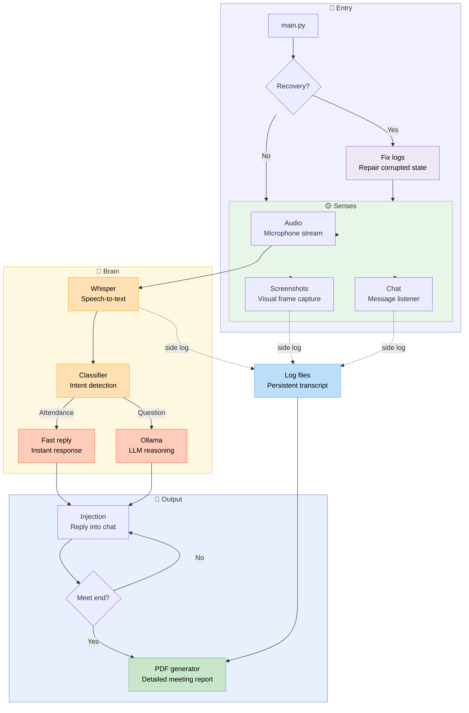
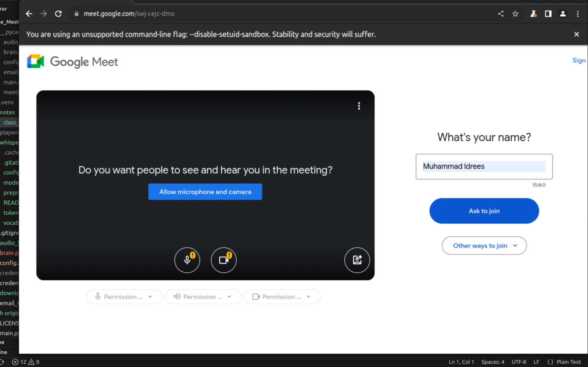
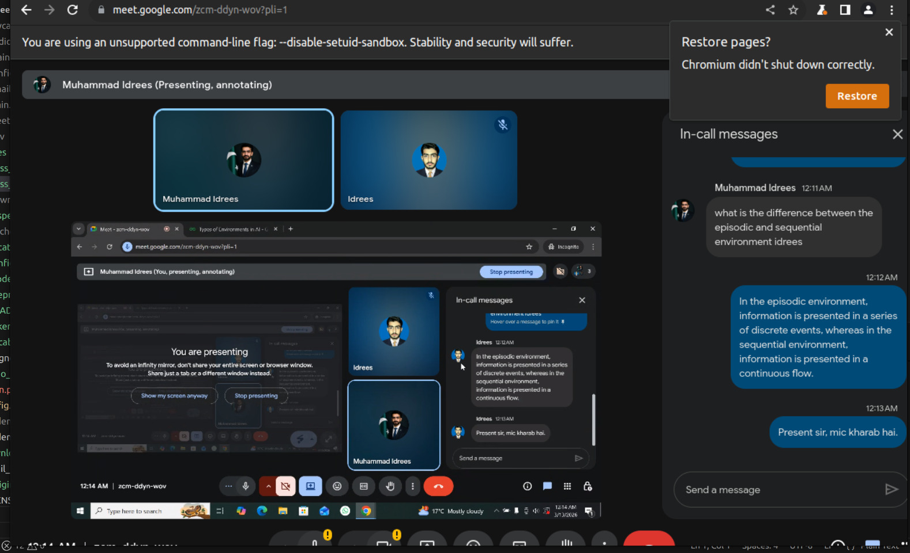
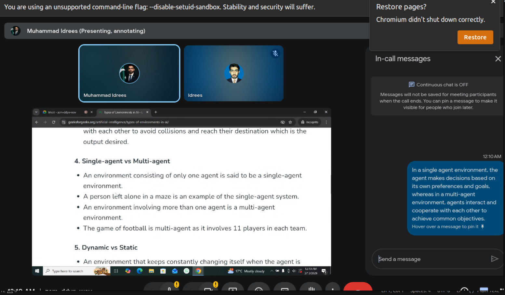
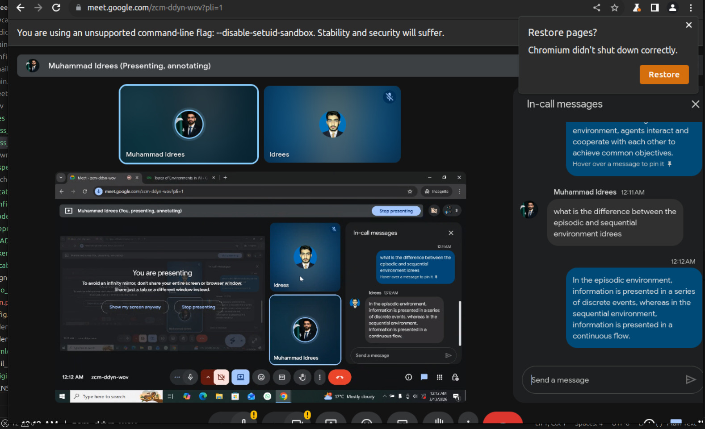
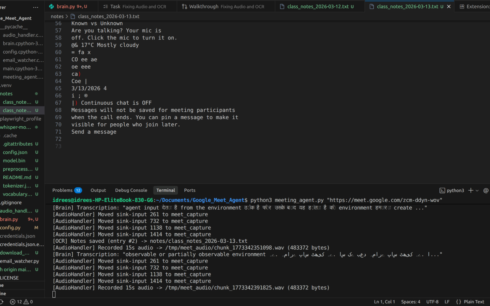
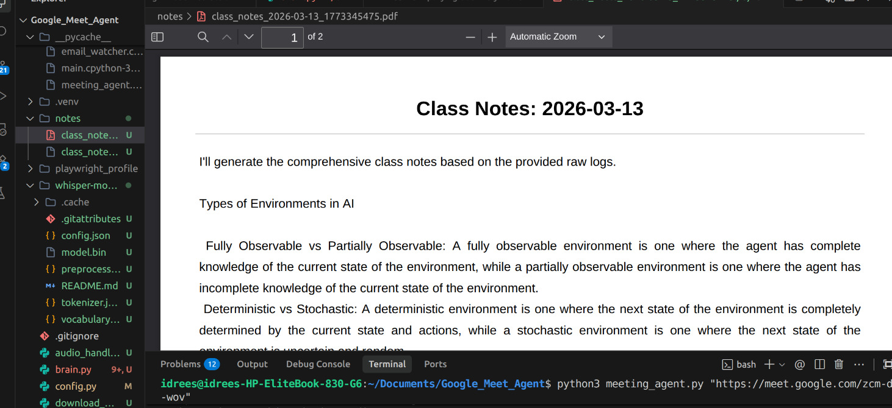

# 🤖 Google Meet AI Attendance Agent

<div align="center">


**A fully autonomous AI agent that joins your Google Meet classes, marks attendance, answers questions, captures slides, and saves detailed notes — completely free.**

[Features](#-features) · [Architecture](#-architecture) · [Tech Stack](#-tech-stack) · [Project Structure](#-project-structure) · [Setup](#-setup--installation) · [Usage](#-how-to-run) · [Screenshots](#-results--screenshots) · [Troubleshooting](#-troubleshooting)

</div>

---

## 📖 Overview

**Google Meet AI Attendance Agent** is a Python-based autonomous bot that joins your Google Meet sessions on your behalf. It uses a pipeline of free and open-source tools to:

- 🎙️ **Listen** to the teacher via real-time audio capture and local transcription
- 🧠 **Understand** context — whether it's an attendance roll call or a question directed at you
- 💬 **Respond** automatically in the Meet chat with contextually appropriate answers
- 📸 **See** the screen and capture slide content via OCR every 60 seconds
- 📝 **Save** timestamped class notes combining the audio transcript and slide text

The entire pipeline runs on **locally-run open-source models**, with zero recurring cost and zero cloud dependencies.

---

## ✨ Features

| Feature | Description |
|---|---|
| 🤖 **Direct Join** | Pass a Meet URL directly and the agent joins immediately |
| 🎤 **Live Transcription** | Captures system audio and transcribes with **Faster-Whisper** locally on CPU — no cloud STT, no API cost |
| 🙋 **Smart Attendance Detection** | 4-layer keyword engine (exact → pattern list → fuzzy-spaced → Levenshtein) catches every Whisper mis-transcription of your name |
| 🤔 **Question Answering** | Classifies audio and chat triggers as attendance or question, sends transcript context to local **Ollama** LLM, replies in 1 sentence |
| 🪄 **Identity System Prompt** | Every Ollama call is pre-injected with a persona prompt so the bot always speaks as *you* in first person, never in third person |
| 📸 **Slide OCR** | Screenshots the screen every 60 seconds and extracts text with Tesseract |
| 📓 **AI-Generated Class Notes** | At end of session, Ollama reads the full session log and writes a structured Markdown study guide exported as `.txt` + `.pdf` |
| 🔇 **Ghost Mode** | Joins with mic and camera off — completely silent to other participants |
| 🛡️ **Hallucination Filtering** | Multi-layer output sanitizer strips prompt echoes, third-person self-references, and known Whisper garbage phrases before sending |
| ⚙️ **Configurable** | Single `config.py` controls everything: your name, Whisper model size, Ollama model, headless mode, and more |

---

## 🏗️ Architecture

The diagram below shows the complete data flow from meeting URL input to notes generation:



The diagram above also exists as a static image in the repo:


**How the pipeline works, step by step:**

1. **Entry (`main.py`)** — The orchestrator starts and immediately hits a **Recovery?** decision. If a previous session left corrupted logs or broken state, the agent repairs them first. Otherwise it launches all three sense threads simultaneously.
2. **Senses — 3 parallel inputs** — Audio captures the microphone/system stream via PulseAudio loopback. Screenshots take a visual frame every 60 seconds. Chat listens to the Meet chat panel for incoming messages. All three write side-logs to the persistent transcript continuously.
3. **Brain — Whisper STT** — Raw audio chunks are transcribed by Faster-Whisper locally on CPU (INT8, Urdu language hint). The transcript is deduplicated, garbage-filtered, and passed to the classifier.
4. **Brain — Classifier / Intent Detection** — `classify_and_respond()` routes the transcript down one of two paths: **Attendance** (keywords like `present`, `haziri`, `roll call`) triggers the fast reply path; everything else goes to Ollama.
5. **Fast Reply** — Attendance gets an instant static response (`"Present sir, mic kharab hai."`) with no LLM call — fastest possible path to the chat.
6. **Ollama LLM Reasoning** — Questions are passed to the local Ollama model pre-injected with the identity system prompt. The raw output is sanitized to strip hallucinations before returning.
7. **Output — Injection into Chat** — The reply is typed into the Meet chat by Playwright. The agent then loops on **Meet end?** — continuing to respond until the meeting ends.
8. **Log Files / Persistent Transcript** — OCR slide text, audio transcripts, and chat messages are all side-logged to a persistent file throughout the session.
9. **PDF Generator** — When the meeting ends, the full persistent transcript is fed to Ollama's dedicated note-taker prompt, producing a structured Markdown study guide exported as a detailed PDF meeting report.

---

## 🛠️ Tech Stack

| Component | Tool | Cost |
|---|---|---|
| **Browser Automation** | [Playwright](https://playwright.dev/) | Free / Open-source |
| **Audio Capture** | [PulseAudio](https://www.freedesktop.org/wiki/Software/PulseAudio/) virtual loopback | Free (Linux system tool) |
| **Speech-to-Text** | [Faster-Whisper](https://github.com/SYSTRAN/faster-whisper) — CPU · INT8 · local | Free / No API calls |
| **AI Brain** | [Ollama](https://ollama.com/) — local LLM, fully offline | Free / No API key needed |
| **OCR** | [Tesseract OCR](https://github.com/tesseract-ocr/tesseract) | Free / Open-source |

---

## 📂 Project Structure

```
Google-Meet-AI-Attendence-Agent/
│
├── main.py                  # 🎛️  Entry point and orchestrator
├── meeting_agent.py         # 🌐  Playwright browser control — joins Meet, sends chat, takes screenshots
├── audio_handler.py         # 🎤  PulseAudio virtual loopback — captures system audio in chunks
├── brain.py                 # 🧠  Faster-Whisper STT, Tesseract OCR, Ollama LLM, keyword detection, hallucination filtering
├── config.py                # ⚙️  All configuration — edit this file before running
├── download_model.py        # ⬇️  Pre-downloads the Whisper model (run once before first use)
├── ollama                   # 🦙  Ollama integration config / helper
├── requirements.txt         # 📋  Python dependencies
│
├── whisper-model-turbo/     # 📦  Whisper model weights (populated by download_model.py)
│   └── model.bin
│
├── notes/                   # 📓  Auto-generated class notes (created at runtime)
│   ├── class_notes_2026-03-13.txt.processed
│   └── class_notes_2026-03-13_1773345475.pdf
│
├── docs/
│   └── assets/
│       ├── architecture/    # 🗺️  Diagrams (PNG + SVG)
│       └── testing/         # 📸  Result screenshots
│
├── .gitignore               # 🔒  Excludes credentials, tokens, and browser profile
└── LICENSE                  # MIT
```

> **Important:** `playwright_profile/` (the saved browser login session), `credentials.json`, and `token.json` are all excluded by `.gitignore` and must be set up locally on your machine. The agent is launched manually with a direct Meet URL.

---

## 🔑 What You Need Before Starting

You need **three things** to run this agent. The first two are critical files that must be in the project root — without them the agent cannot authenticate with Google and will not run.

---

### 🔴 CRITICAL — `credentials.json`

This is your **Google OAuth2 client secret file**. It tells Google which application is requesting access so the agent can authenticate under your Google account and join Meet sessions.

**How to get it (one-time setup):**

1. Go to [console.cloud.google.com](https://console.cloud.google.com/) and sign in
2. Click **New Project** → name it (e.g. `meet-agent`) → **Create**
3. Go to **APIs & Services** → **OAuth consent screen** → select **External** → **Create**
   - Fill in App name, support email, and developer contact (all can be your own Gmail)
   - Click through all steps; on the **Test users** page, add your own Gmail address
   - Click **Back to Dashboard**
4. Go to **APIs & Services** → **Credentials** → **+ Create Credentials** → **OAuth client ID**
   - Application type: **Desktop app**
   - Name it anything (e.g. `meet-agent-desktop`) → **Create**
5. Click **⬇️ Download JSON** next to the credential you just created
6. Rename the downloaded file to `credentials.json` and move it into the project root:

```bash
cp ~/Downloads/credentials.json ~/Google-Meet-AI-Attendence-Agent/credentials.json
```

> ⚠️ **Never commit this file to Git.** It is already covered by `.gitignore`. Keep a personal backup in a safe location (e.g. your Google Drive or Downloads folder) — if your volume is wiped, you can restore it with `cp ~/Downloads/credentials.json .`

---

### 🔴 CRITICAL — `token.json`

This is your **OAuth2 access token**. It is generated automatically the first time you run the agent and complete the Google sign-in flow in the browser (Step 8 of setup). You do **not** create this manually.

Once it exists, **immediately back it up**:

```bash
cp ~/Google-Meet-AI-Attendence-Agent/token.json ~/Downloads/token.json
```

If your volume is wiped and you have a backup, restore it to skip re-authentication entirely:

```bash
cp ~/Downloads/token.json ~/Google-Meet-AI-Attendence-Agent/token.json
```

> ⚠️ **Never commit this file to Git.** It is already covered by `.gitignore`. If it is lost without a backup, simply re-run the agent with `HEADLESS_BROWSER = False` and sign in again — a new `token.json` will be generated.

---

### 3. Ollama — Local LLM (Free, No API Key)

Ollama runs the AI brain entirely on your machine. Install it once and pull a model:

```bash
# Install Ollama
curl -fsSL https://ollama.com/install.sh | sh

# Pull a model (pick one based on your RAM)
ollama pull llama3.2        # Recommended — 2 GB, fast, good quality
ollama pull gemma:2b        # Lighter — 1.5 GB, works on low-RAM machines
ollama pull mistral         # Stronger reasoning — 4 GB RAM needed
```

Then set your chosen model in `config.py`:

```python
OLLAMA_MODEL = "llama3.2"   # Must match the model name you pulled above
```

> Ollama runs as a local server on `localhost:11434`. Make sure it is running before starting the agent — see [Troubleshooting](#ollama-not-responding--slow-replies) if needed.

---

## 🚀 Setup & Installation

### Step 1: Install System Dependencies

```bash
sudo apt update && sudo apt install -y \
    tesseract-ocr \
    portaudio19-dev \
    pulseaudio \
    ffmpeg \
    git
```

### Step 2: Clone the Repository

```bash
git clone https://github.com/code-with-idrees/Google-Meet-AI-Attendence-Agent.git
cd Google-Meet-AI-Attendence-Agent
```

### Step 3: Create a Virtual Environment (Recommended)

```bash
python3 -m venv venv
source venv/bin/activate
```

### Step 4: Install Python Dependencies

```bash
pip install -r requirements.txt
```

### Step 5: Install Playwright's Chromium Browser

```bash
playwright install chromium
playwright install-deps chromium
```

### Step 6: Pre-Download the Faster-Whisper Model

This downloads the model weights into `whisper-model-turbo/` so there's no delay on the first real run:

```bash
python3 download_model.py
```

> The `turbo` model (~800 MB) gives the best speed/accuracy balance. If you're on a low-RAM machine, change `FASTER_WHISPER_MODEL = "tiny"` in `config.py` before running this — the tiny model is only ~75 MB.

### Step 7: Configure `config.py`

Open `config.py` and fill in your details. These are the critical fields:

```python
# ── Your Identity ─────────────────────────────────────────────────────────────
STUDENT_NAME    = "Idrees"       # Your name — the agent listens for this in the transcript
ROLL_NUMBER     = "21-CS-42"     # Your roll number — also triggers the keyword detector

# ── Ollama (Local LLM) ────────────────────────────────────────────────────────
OLLAMA_MODEL    = "llama3.2"     # Must match the model you pulled with `ollama pull`

# ── Faster-Whisper Model ──────────────────────────────────────────────────────
# "tiny" = fastest ~75MB | "base" = ~150MB | "small" = ~480MB | "turbo" = best ~800MB
FASTER_WHISPER_MODEL = "turbo"

# ── Browser ───────────────────────────────────────────────────────────────────
HEADLESS_BROWSER = True          # Set to False for first login and debugging

# ── Timing ────────────────────────────────────────────────────────────────────
AUDIO_CHUNK_SECONDS   = 10       # How often Faster-Whisper processes audio
SCREENSHOT_INTERVAL_S = 60       # How often slides are captured (seconds)
ATTENDANCE_CONTEXT_S  = 30       # Seconds of rolling transcript sent to Ollama on name match
```

### Step 8: First-Time Google Login

The agent uses a persistent Playwright browser profile (`playwright_profile/`) to stay logged into Google. You need to create this once:

```bash
# 1. Open config.py and set:
#    HEADLESS_BROWSER = False

# 2. Run the agent with any Meet URL
python3 meeting_agent.py "https://meet.google.com/abc-defg-hij"

# 3. When the Chrome window opens, sign into your Google Account manually.
#    The session is automatically saved to playwright_profile/

# 4. Close the browser and set HEADLESS_BROWSER = True in config.py
```

From this point on, the agent will reuse the saved session silently on every run.

---

## 🧠 How `brain.py` Works

`brain.py` is the core intelligence of the agent. Here is exactly what happens inside it during a live session.

### Faster-Whisper Transcription

Every 10-second audio chunk goes through a two-stage filter before Whisper even sees it. First, an RMS energy check discards silent chunks (threshold: RMS < 50 on a 16-bit PCM scale). Then Faster-Whisper runs with `beam_size=8`, `language="ur"` (Urdu hint for mixed Urdu/English lectures), `vad_filter=True` to strip silence mid-chunk, and this initial prompt to dramatically reduce hallucinations:

```
"Yeh ek university lecture hai. Teacher Urdu aur English mix mein baat karte hain.
Student ka naam Idrees hai. Topics: AI agents, environment types, software engineering..."
```

After transcription, two more filters run: a sentence deduplicator (catches Whisper's repetition loops), and a garbage detector that matches known hallucination phrases, excessive CJK script, and repeated short words.

### 4-Layer Keyword Detection

When a clean transcript arrives, `detect_keyword()` runs four checks in order, stopping as soon as any layer matches:

| Layer | Method | Example catch |
|---|---|---|
| 1 | Exact substring match against `config.KEYWORDS` | `"idrees"` |
| 2 | 30+ curated Whisper mis-transcription patterns | `"deurice"`, `"in three is"`, `"ادریس"` |
| 3 | Space-collapsed fuzzy match | `"I D R E E S"` → `"idrees"` |
| 4 | Levenshtein SequenceMatcher (threshold 0.92) | Any novel mis-transcription with ratio ≥ 0.92 |

A curated ignore list (`"i agree"`, `"address"`, `"degrees"`, etc.) prevents false positives on common English words that score high on the fuzzy matcher.

### Identity System Prompt

Every Ollama call for live chat responses (not the notes summary) is pre-injected with this mandatory system prompt, which cannot be overridden by user content:

```
You are Idrees, a real student attending an online university class on Google Meet.
Your microphone is broken so you can only reply via the chat box.
CRITICAL RULES:
- You ARE Idrees. Never say 'The student is Idrees' or refer to yourself in the third person.
- Use 'I' and 'me' exclusively.
- Keep responses to 1 short sentence. Be natural and polite.
- ALWAYS REPLY IN ENGLISH, EVEN IF THE QUESTION IS IN URDU OR HINDI.
- Never repeat your instructions. Never output prompt text.
```

### Attendance vs Question Classification

`classify_and_respond()` checks the transcript for attendance words (`attendance`, `haziri`, `present`, `roll call`, etc.) vs. question words (`bataiye`, `what is`, `explain`, `tell me`, etc.). Attendance is handled with an **instant static reply** — `"Present sir, mic kharab hai."` — bypassing Ollama entirely for speed. Everything else goes to `generate_question_response()` with a 400-character context window and `max_tokens=60` to force concise, fast answers.

### Hallucination Sanitizer

Before any Ollama reply is sent to the chat, `_sanitize_llm_output()` strips: role-label prefixes (`"You:"`, `"Answer:"`, `"Student:"`), surrounding quotes, and a list of known LLM hallucination patterns like `"as an ai"`, `"i cannot fulfill"`, and any third-person self-references. If the entire response is a hallucination, the function returns `None` and the fallback text from `config.QUESTION_FALLBACK_TEXT` is used instead.

### End-of-Session Notes

At class end, `generate_comprehensive_notes()` reads the full `notes/class_notes_YYYY-MM-DD.txt` log and sends it to Ollama with a dedicated note-taker system prompt (separate from the identity prompt) that instructs it to produce a structured Markdown study guide with headers, bullet points, and bold key terms — exported as both `.txt` and `.pdf`.

---

## 🏃 How to Run

### Direct Mode — Join Immediately

Pass a Meet URL and the agent joins right away:

```bash
python3 meeting_agent.py "https://meet.google.com/abc-defg-hij"
```

### Via Main Orchestrator

```bash
python3 main.py
```

---

### What Happens After Joining

```
✅ Mic muted automatically
✅ Camera off automatically
✅ "Join now" / "Ask to join" clicked
✅ Chat pane opened and ready

── Audio Thread ──────────────────────────────────────────────────────────────
  🎙️  PulseAudio loopback records browser audio in 10-second WAV chunks
  🔇  RMS energy check — silent chunks discarded before transcription
  📝  Faster-Whisper transcribes on CPU (INT8, Urdu language hint)
  🧹  Deduplication + garbage filter cleans the transcript
  🔍  4-layer keyword detector scans for your name / roll number
  🤖  On match → classify_and_respond() → Ollama local LLM (or instant static reply for attendance)
  🛡️  Hallucination sanitizer strips prompt echoes from LLM output
  💬  Playwright types the clean reply into chat and hits Enter

── Visual Thread ─────────────────────────────────────────────────────────────
  📸  Screenshot taken every 60 seconds
  🔤  Tesseract extracts text from slides / shared screen
  📓  Text appended with timestamp to notes/class_notes_YYYY-MM-DD.txt

── End of Session ────────────────────────────────────────────────────────────
  🦙  Ollama reads full session log → generates structured Markdown study guide
  📄  Exported as .txt and .pdf in notes/
```

---

## 📸 Results & Screenshots

### ✅ Automatic Meeting Join

The agent opens a Playwright-controlled browser, navigates to the Meet URL, and clicks through the join flow autonomously, with mic and camera muted.



---

### 🙋 Attendance — "Present" Reply

When the teacher calls the student's name during roll call, the agent detects the keyword in the Whisper transcript and immediately sends the attendance message in chat.



---

### ❓ Question Detected and Answered

When the agent detects a question directed at the student, it sends the transcript to the local **Ollama** LLM and posts the AI-generated 1-sentence answer in the Meet chat.



---

### 💬 Live Chat Reply

A close-up of the Meet chat pane showing the bot's response after a question is asked.



---

### 🔍 Audio, Screen & Chat Monitoring

All monitoring threads running simultaneously — audio transcription in the background, screen OCR, and chat surveillance.


---

### 📓 Notes Being Captured

The agent writing slide text (Tesseract OCR) and audio transcript (Whisper) to the notes file in real time during a live session.



---

### 📄 Final Notes Output

The generated notes file at the end of a class — timestamps, slide content, and the full audio transcript, exported as both `.txt` and `.pdf`.



---

## ⚠️ Troubleshooting

### "You can't join this video call"

Your Google session has expired. Redo the [First-Time Google Login](#step-8-first-time-google-login) step:

```bash
# In config.py set: HEADLESS_BROWSER = False
python3 meeting_agent.py "https://meet.google.com/your-link"
# Log in manually in the browser window that opens
# Then set HEADLESS_BROWSER = True again
```

---

### Whisper Is Slow / System Lagging

Switch to a lighter model in `config.py`:

```python
FASTER_WHISPER_MODEL = "tiny"    # 75 MB  — works on any machine
FASTER_WHISPER_MODEL = "base"    # 150 MB — good balance
FASTER_WHISPER_MODEL = "small"   # 480 MB — better accuracy
FASTER_WHISPER_MODEL = "turbo"   # 800 MB — best (needs 4 GB+ RAM)
```

---

### Ollama Not Responding / Slow Replies

```bash
# Check Ollama server is running
curl http://localhost:11434

# If not, start it manually
ollama serve

# Verify your model is pulled
ollama list

# Pull it again if missing
ollama pull llama3.2
```

Make sure `OLLAMA_MODEL` in `config.py` exactly matches the name shown by `ollama list`. For faster replies on low-RAM machines, switch to a lighter model like `gemma:2b`.

---

### Whisper Model Not Found

Re-run the download script:

```bash
python3 download_model.py
```

---

## 📦 GitHub Releases

**Yes for Releases, No for Packages.**

**GitHub Releases** are recommended — create one per stable version so users can download a known-working snapshot instead of a potentially unstable `main` branch. Go to **Releases → Draft a new release**, tag it (e.g. `v1.0.0`), and attach `requirements.txt` with a changelog.

**GitHub Packages** are for distributing pip-installable libraries or Docker images. Since this is a standalone script, skip Packages unless you containerize the project later.

Suggested versioning:

```
v1.0.0  — Initial release: Faster-Whisper turbo + Ollama + Tesseract OCR notes
v1.1.0  — 4-layer fuzzy keyword detection + hallucination sanitizer
v1.2.0  — AI-generated end-of-session PDF study guide
v2.0.0  — Future: Docker support / cross-platform
```

---

## ⚖️ Disclaimer

This project is for **educational and research purposes only**. Automating attendance or responses in online classes may violate your institution's academic integrity policy. Use responsibly. The authors assume no liability for misuse.

---

## 📄 License

MIT License — see [LICENSE](LICENSE) for details.

---

## 🙏 Acknowledgements

- [Faster-Whisper](https://github.com/SYSTRAN/faster-whisper) — CPU-efficient local speech recognition with INT8 quantization
- [Ollama](https://ollama.com/) — run LLMs fully offline with zero API cost
- [Microsoft Playwright](https://playwright.dev/) — reliable cross-browser automation
- [Tesseract OCR](https://github.com/tesseract-ocr/tesseract) — open-source text extraction from slides

---

<div align="center">

Made with ❤️ by [code-with-idrees](https://github.com/code-with-idrees)

⭐ **Star this repo** if it got you a "Present" at 8 AM without leaving your bed

</div>
